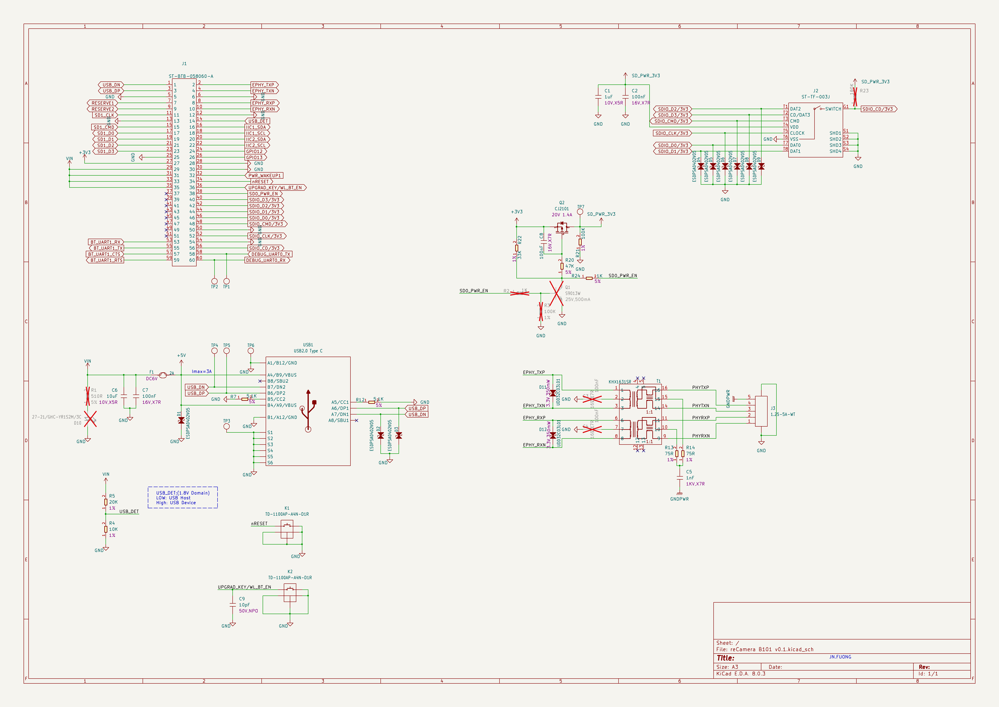

# Introduction

## What's reCamera?

reCamera is the combination of a **processor** with a **camera sensor**.

This combination makes reCamera a standalone system which could handle some basic detection & control tasks along.

## Why we make reCamera?

Today, as the processors (both SOC and MCU) are becoming smaller and powerful, putting the processor together with camera sensors are becoming doable. Indeed many IPCs (IP camera) are already using this design to acclerate AI detection on edge devices. 

So today we make reCamera, this open-source camera platform for everyone to play with. And we split this project into 3 changable parts:
- Core Board
- Sensor Board
- Base Board

This design will let you to easily change the interfaces, camera sensors to the ones you want to use. And we hope these componenets could be freely used as any combination.  

And after we could build up this hardware platform and ecosystem, other applications could grow on these platform without a worriness of changing from platform to platform in the future.

## Core Board

| Board         | Features                           | Version Info |
| ------------- | ---------------------------------- | ------------ |
| [C1_2002w]    | eMMC  WIFI/BLE module   OnBoard antenna   External antenna connector| 1.0 |
| C1_2002       | eMMC  Extra SDIO to base board   Extra UART to base board | WIP |

#### C1_2002w
This core board utilized the SOC SG2002. In addition to the on-board eMMC, there are also on-board wireless solution ready for use. The wireless module along with the on-board antenna could provides you the basic WIFI/BLE connection ability.

While the on-board antenna cannot have a good long-range performace, you could also choose to use external antenna with the IPEX connector on-board.

> overview
  
Up             |  Bottom
:-------------------------:|:-------------------------:
  |  

>schematic

## Sensor Board

| Board         | Features                           | Latest Version                                                   |
| ------------- | ---------------------------------- | ------------------------------------------------------------ |
| [S1_OV5647](./S1_OV5647/) | 5MP   Rolling Shutter | 1.0 |
| S2_IMX335     | 5MP   Rolling Shutter | WIP |
| S3_SC130GS    | 1MP  Global Shutter    | WIP |

### S1_OV5647

> overview

>schematic

> features:

<table ><tbody>
<tr >
    <td >SENSOR</td>
    <td class="dbon">ov5647</td>
    <td class="dbon">CMOS SIZE</td>
    <td class="dbon">1/4 inch</td>
</tr>
<tr >
    <td class="dbon">PIXELS</td>
    <td class="dbon">5MP</td>
    <td class="dbon">APERTURE</td>
    <td class="dbon">F2.4</td>
</tr>
<tr >
    <td >FOCAL LENGTL</td>
    <td class="dbon">3.89mm</td>
    <td class="dbon">FIELD OF VIEW</td>
    <td >72.9°</td>
</tr>
<tr >
    <td >DISTORTION</td>
    <td >&lt;1.5%</td>
    <td >DEPTH OF FIELD</td>
    <td >20cm ~∞</td>
</tr>
<tr >
    <td >IMAGE</td>
    <td  colspan="3">2592 x 1944 still picture resolution</td>
</tr>
<tr >
    <td >VIDEO</td>
    <td  colspan="3">1920 x 1080p @30, 1280 x 720p @60, 640 x 480p @60, 640 x 480p @90</td>
</tr></tbody>
</table>

- 4 x LED fill lights
- 1 x microphone
- 1 x speaker
- 3 x LED indicator

### S2_IMX335
> overview

> schematic

> features:

### S3_SC130GS

> overview

> schematic

> features:

## Base Board
### B1_Default

> overview
>

  

>schematic

> features:

- 1 x Type-C port for power input and communication.
- 1 x Single Port Transformer Module for Ethernet communication support.
- 1 x SD card reader for data storage and exchange.

### B2_POE

> overview

  

>schematic

> features:

- The board supports PoE (Power over Ethernet) for power supply, which allows power to be transmitted over Ethernet cables and simplifies the power supply for network devices.
- The board supports serial communication, allowing bidirectional communication with other devices through a serial interface and facilitating interaction between the board and makers.

### B2_POE

> overview

  

>schematic

> features:

- The board supports PoE (Power over Ethernet) for power supply, which allows power to be transmitted over Ethernet cables and simplifies the power supply for network devices.
- The board supports serial communication, allowing bidirectional communication with other devices through a serial interface and facilitating interaction between the board and makers.

## reCamera Softwares

### [reCamera OS](https://github.com/Seeed-Studio/reCamera-OS)

This is the default buildroot system running in reCamera.

### [reCamera Web]

- [Backend](https://github.com/Seeed-Studio/sscma-example-sg200x)
- [Frontend]()

This is the default Web backend running in reCamera OS. It provides user with a web interface for network configuration, live view, web ssh and other security configuration.

## Related Projects

### [reCamera Gimbal](https://github.com/AllenKon/Seeed_reCamera_Gimbal)

Open source Gimbal solution made using reCamera.

### [reCamera Robot Arm]()

waiting...
