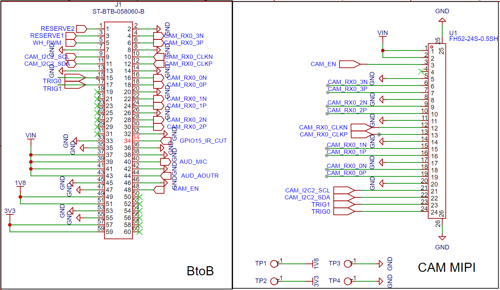
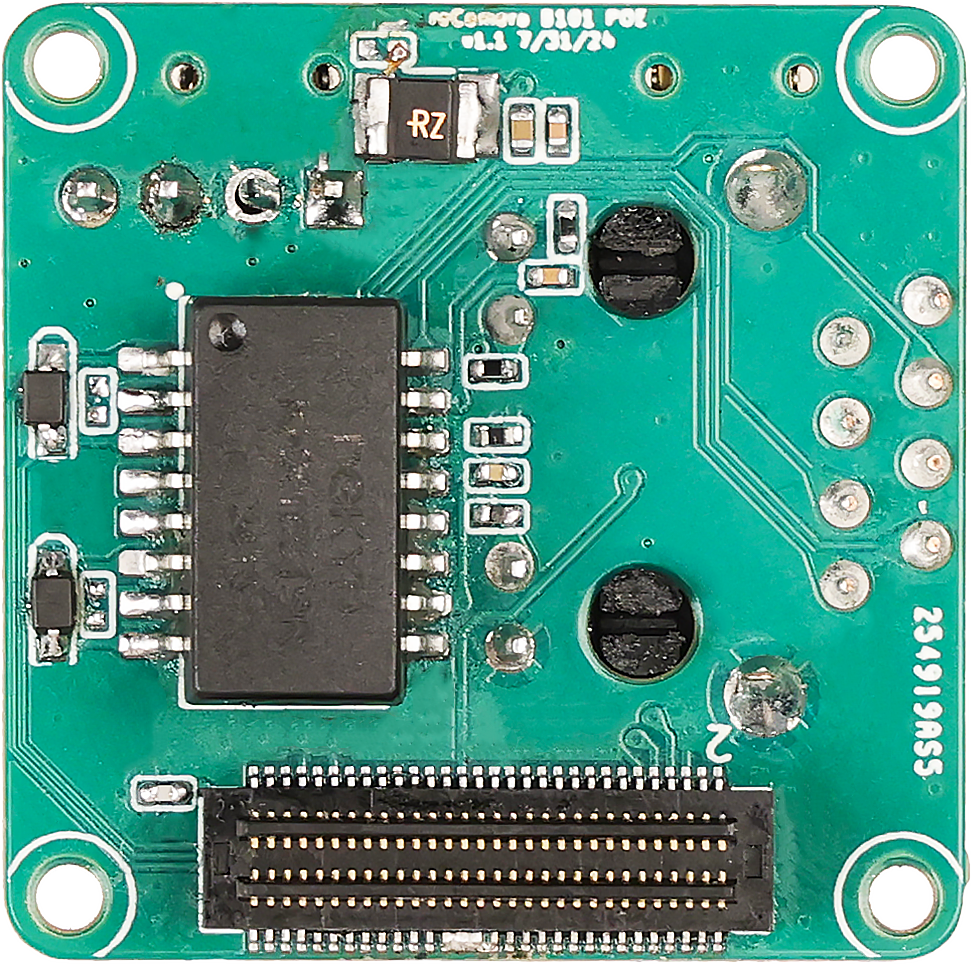
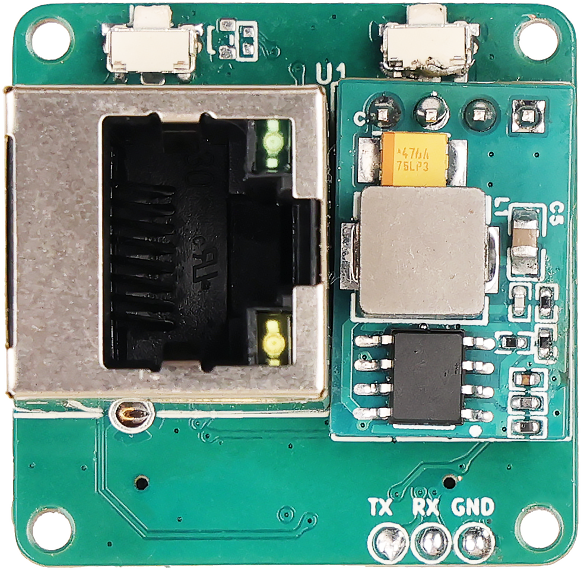

# Introduction

## ✨ What's reCamera? 

reCamera is a combination of a **processor** and a **camera sensor**.

This combination makes reCamera a standalone system that can handle basic detection and control tasks on its own.

## 💡 Why we make reCamera? 

Today, as processors (both SOC and MCU) are becoming smaller and more powerful, it is now possible to combine the processor with camera sensors. In fact, many IPCs (IP cameras) are already using this design to accelerate AI detection on edge devices.

So today, we introduce reCamera, an open-source camera platform for everyone to play with. We have divided this project into 3 interchangeable parts:
- Core Board
- Sensor Board
- Base Board

This design allows you to easily change the interfaces and camera sensors to suit your needs. We hope that these components can be freely combined in any way.

By building this hardware platform and ecosystem, we enable other applications to grow on this platform without the need to worry about changing from one platform to another in the future.

The engineering focus on modularity, high performance, and ease of use ensures that reCamera serves as a powerful platform for developers and makers. This design streamlines complex hardware processes, allowing users to integrate vision AI capabilities into their systems efficiently and creatively. 

We've taken care of the intricate hardware work, freeing up time for user innovation. The modular design enables users to rapidly switch cameras and customize interfaces, transforming development from months to weeks only!

Join our group:

## Core Board

| Board         | Features                           | Version Info |
| ------------- | ---------------------------------- | ------------ |
| [C1_2002w](./C1_2002/)    | eMMC  WIFI/BLE module   OnBoard antenna   External antenna connector| 1.0 |
| [C1_2002](./C1_2002/)       | eMMC  Extra SDIO to base board   Extra UART to base board | WIP |

### 💡 C1_2002w
This core board utilized the RISC-V SOC SG2002. In addition to the on-board eMMC, there are also on-board wireless solution ready for use. The wireless module along with the on-board antenna could provides you the basic WIFI/BLE connection ability.

While the on-board antenna cannot have a good long-range performace, you could also choose to use external antenna with the IPEX connector on-board.

### ⚙️ overview
  
Up             |  Bottom
:-------------------------:|:-------------------------:
  |  

### ⚙️ schematic

## Sensor Board

| Board         | Features                           | Latest Version                                                   |
| ------------- | ---------------------------------- | ------------------------------------------------------------ |
| [S1_OV5647](./S1_OV5647/) | 5MP   Rolling Shutter | 1.0 |
| [S2_IMX335](./S2_IMX335/)     | 5MP   Rolling Shutter | WIP |
| [S3_SC130GS](./S3_SC130GS/)    | 1MP  Global Shutter    | WIP |
----
[Sensor Driver Support List](./Sensor_Suppoeted_List.md)

### 💡 S1_OV5647
---
### ⚙️ overview

### ⚙️ schematic

### ⚙️ features:

<table ><tbody>
<tr >
    <td >SENSOR</td>
    <td class="dbon">OV5647</td>
    <td class="dbon">CMOS SIZE</td>
    <td class="dbon">1/4 inch</td>
</tr>
<tr >
    <td class="dbon">PIXELS</td>
    <td class="dbon">5MP</td>
    <td class="dbon">APERTURE</td>
    <td class="dbon">F2.4</td>
</tr>
<tr >
    <td >FOCAL LENGTL</td>
    <td class="dbon">3.89mm</td>
    <td class="dbon">FIELD OF VIEW</td>
    <td >72.9°</td>
</tr>
<tr >
    <td >DISTORTION</td>
    <td >&lt;1.5%</td>
    <td >DEPTH OF FIELD</td>
    <td >20cm ~∞</td>
</tr>
<tr >
    <td >IMAGE</td>
    <td  colspan="3">2592 x 1944 still picture resolution</td>
</tr>
<tr >
    <td >VIDEO</td>
    <td  colspan="3">1920 x 1080p @30fps, 1280 x 720p @60fps, 640 x 480p @60fps, 640 x 480p @90fps</td>
</tr></tbody>
</table>

- 4 x LED fill lights
- 1 x microphone
- 1 x speaker
- 3 x LED indicator

### 💡 S2_IMX335
### ⚙️ overview

### ⚙️ schematic

### ⚙️ features:

<table ><tbody>
<tr >
    <td >SENSOR</td>
    <td class="dbon">IMX335</td>
    <td class="dbon">CMOS SIZE</td>
    <td class="dbon">1/2.8 inch</td>
</tr>
<tr >
    <td class="dbon">PIXELS</td>
    <td class="dbon">5MP</td>
    <td >Focusing</td>
    <td >manually focusing</td>
</tr>
<tr >
    <td >FOCAL LENGTL</td>
    <td class="dbon">3.91mm</td>
    <td class="dbon">FIELD OF VIEW</td>
    <td >106°(D) 92.6°(H) 48.6°(V)</td>
</tr>
<tr >
    <td >IMAGE</td>
    <td  colspan="3">2592 x 1944 still picture resolution</td>
</tr>
<tr >
    <td >VIDEO</td>
    <td  colspan="3">2592 × 1944p @20fps;1920 × 1080p @30fps;1280 × 720p @30fps</td>
</tr></tbody>
</table>

### 💡 S3_SC130GS

### ⚙️ overview

### ⚙️ schematic

Sensor Board             |  BtoB Board
:-------------------------:|:-------------------------:
  |  

### ⚙️ features:

<table ><tbody>
<tr >
    <td >SENSOR</td>
    <td class="dbon">SC130GS</td>
    <td class="dbon">CMOS SIZE</td>
    <td class="dbon">1/2.7 inch</td>
</tr>
<tr >
    <td class="dbon">PIXELS</td>
    <td class="dbon">1.3MP</td>
    <td >Output Format</td>
    <td >RAW MONO/RGB</td>
</tr>
<tr >
    <td >Package</td>
    <td class="dbon">64 pin CLCC</td>
    <td class="dbon">Package Size</td>
    <td >13mm x 13mm</td>
</tr>
<tr >
    <td >IMAGE</td>
    <td  colspan="3"> 1280H x 1024</td>
</tr>
<tr >
    <td >VIDEO</td>
    <td  colspan="3"> 1280H x 1024 @240fps</td>
</tr></tbody>
</table>

## Base Board

| Board         | Features                           | Version Info |
| ------------- | ---------------------------------- | ------------ |
| B1_Default    | Single Port Transformer Module   SD card reader   Type-C port   UART| 1.0 |
| B2_Vertical-mounted Type-C      | Single Port Transformer Module   SD card reader   Type-C port   UART| 0.1 |
| B3_POE    | Power over Ethernet(POE)   UART| 0.1 |
| B4_Gyro      | DC-DC converter   CAN port   UART | 0.1 |

### 💡 B1_Default

### ⚙️ overview

### ⚙️ schematic

### ⚙️ features:

- 1 x Type-C port for power input and communication.
- 1 x Single Port Transformer Module for Ethernet communication support.
- 1 x SD card reader for data storage and exchange.

### 💡 B2_Vertical-mounted Type-C

### ⚙️ overview

### ⚙️ schematic

### ⚙️ features:

- 1 x Type-C port for power input and communication.
- 1 x Single Port Transformer Module for Ethernet communication support.
- 1 x SD card reader for data storage and exchange.

### 💡 B3_POE

### ⚙️ overview

Up             |  Bottom
:-------------------------:|:-------------------------:
  |  

### ⚙️ schematic

### ⚙️ features:

- 1 x RJ45 port for 802.3af PSE.
- 1 x UART port.

### 💡 B4_Gyro

### ⚙️ overview

### ⚙️ schematic

### ⚙️ features:

- 1 x CAN port.
- 1 x Gyroscope sensor.
- 1 x UART port.

## reCamera Softwares

### [reCamera OS](https://github.com/Seeed-Studio/reCamera-OS)

This is the default buildroot system running in reCamera.

### reCamera Web

- [Backend](https://github.com/Seeed-Studio/sscma-example-sg200x)
- [Frontend]

This is the default Web backend running in reCamera OS. It provides user with a web interface for network configuration, live view, web ssh and other security configuration.

## reCamera Pocket

In order to make reCamera last longer, we developed a matching battery compartment, the reCamera Pocket, which is divided into vertical and horizontal, allowing reCamera to be mounted on it at different angles.

## Related Projects

### [reCamera Gimbal](https://github.com/AllenKon/Seeed_reCamera_Gimbal)

Open source Gimbal solution made using reCamera.

### reCamera Industrial 

WIP..

### [reCamera Robot Arm]()

WIP..
